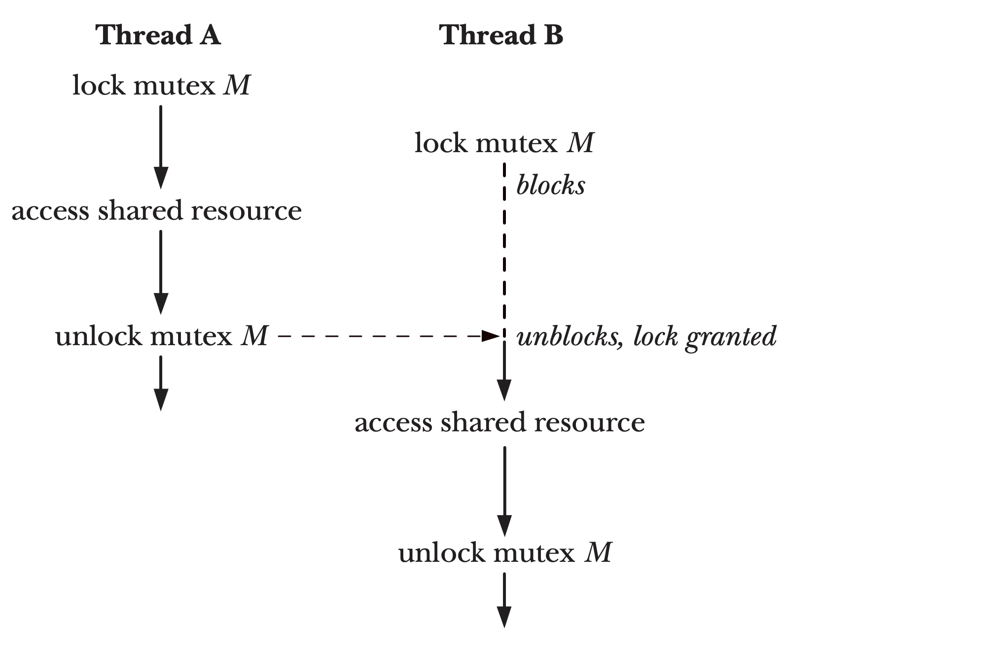
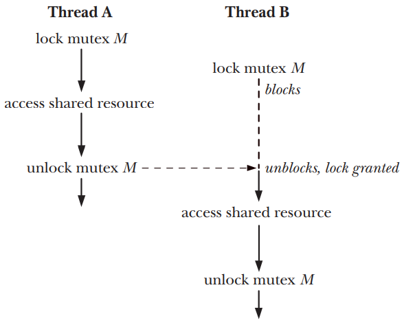

# Posix Threads

A thread is a mechanism that allow an application to perform multiple tasks concurrently.
A single process can contain multiple threads. All of the threads are independently executing
the same program and they all share the same global memory including the initialized data,
uninitialized data and heap memory segments


## Threads and Errno

in the traditional UNIX API, errno is a global variable. However this doesn't suffice for threaded programs,
if a thread made a function call that returned an error in global errno variable, then this would confuse other
threads that might also be making function calls to check errno, therefore in threaded programs each thread has
its own errno value.

## Return value

All pthreads function return 0 on success or positive integer on failure. the failure value is the same
value that can be placed in errno

## Compiling Pthreads prograns

On linux, programs that use pthread api must compile with -pthread option the effect if this option 
include the following:

- the _REENTRANT preprocessor macro is defined this cause the  declaration of a few reentrant function to be 
exposed.

- the program is linked with the *libpthread* library (-lpthread)

## Thread creation

```c
#include <pthread.h>

int pthread_create(pthread_t *thread, const pthread_attr_t *attr,
 void *(*start)(void *), void *arg);
```

When a program is started the resulting process consists of a single thread called the initial or main thread,
the pthread_function create new thread. The new thread begin execution by calling the function identified by start
with the argument arg ( start(arg) ). the thread that calls pthread_create continue execution.
- The *arg* is declared as void * meaning that we can pass a pointer to any type of object to the start function.
and the same implies for the return value.
- The *thread* argument point to a buffer of type *pthread_t* into which the unique identifier for this thread is copied
before *pthread_create* is returned. this identifier can be used later to refer to that thread.
- The *attr* argument is pointer to *pthread_attr_t* object that specifies various attributes for the new thread
if *attr* is *NULL* then the thread is created with various default attributes.

After the call to *pthread_create* a program has no guarantees about which thread will be next scheduled by the 
[task scheduler](https://en.wikipedia.org/wiki/Scheduling_(computing)#Process_scheduler). If we want need to enforce
a particular order of execution we must use one of the synchronization techniques.

## Thread termination

The execution of a thread terminates in one of the following ways:

- the thread start function performs a return value.
- the thread calls *pthread_exit()*.
- the thread is canceled using *pthread_cancel()*.
- any of the threads call *exit()* or the main thread performs a return in the main function.

```c
#include <pthread.h>
void pthread_exit(void *retval);
```

Calling the *pthread_exit()* is equavalent to performing a return in the thread start function.

## Thread IDs

Each Thread withing a process is uniquely identified by a thread ID, this ID is returned to the caller
of *pthread_create()* and a thread can obtain its own id using *pthread_elf()*.

```c
#include <pthread.h>
pthread_t pthread_self(void); // Returns the thread ID of the calling thread
```
Thread IDs are useful withing the following reasons:

- Various pthreads functions use thread IDs to identifier the thread on which they are to act.
- It can be useful to tag dynamic data with the id of a particular thread

The *pthread_equal()* function allows us to check whether tow thread IDs are the same.
```c
#include <pthread.h>
int pthread_equal(pthread_t t1, pthread_t t2); // Returns nonzero value if t1 and t2 are equal, otherwise 0
```

## Joining with a terminated thread

The *pthread_join()* function waits for the thread identified by thread to terminate. And if the thread
is already terminated the function return immediately. The operation is termed joining
```c
#include <pthread.h>
int pthread_join(pthread_t thread, void **retval); // Returns 0 on success, or a positive error number on error
```

Calling *pthread_join()* for a thread ID that has been already join can lead to undefined behavior. It
might instead joined a thread created later that happens to have the same ID. If a thread is not detached,
then we must join with it using *pthread_join()*. If we fail to do this then when the thread terminates
it produced the thread equivalent of a zombie process.
The task of *pthread_join()* is similar to that performed by *waitpid()* for precesses.

```c
#include <pthread.h>
#include <string.h>
#include <stdio.h>
#include <stdlib.h>

static  void *threadFunc(void *arg) {
	char *s = (char *)arg;

	printf("%s\n", s);

	return (void *)strlen(s);
}

int main() {
	pthread_t t1;
	void *res;
	int s;

	res = 0;
	s = pthread_create(&t1, NULL, threadFunc, "Hello World");
	printf("thread returned %ld\n", (long)res);
	exit(EXIT_SUCCESS);
}
```

When this code is run nothing happens because main function exit before the created thread returns

```c
#include <pthread.h>
#include <string.h>
#include <stdio.h>
#include <stdlib.h>

static  void *threadFunc(void *arg) {
	char *s = (char *)arg;

	printf("%s\n", s);

	return (void *)strlen(s);
}

int main() {
	pthread_t t1;
	void *res;
	int s;

	res = 0;
	s = pthread_create(&t1, NULL, threadFunc, "Hello World");
	s = pthread_join(t1, &res);
	printf("thread returned %ld\n", (long)res);
	exit(EXIT_SUCCESS);
}
```

When this code is run it behave as expected printing *Hello World* in the created thread and then printing the return status of the thread

## Detaching a Thread

A thread is joinable, meaning that another thread can obtain its return status using *pthread_join()*. But sometimes we don't care about that
value and we just want the system to clean up the remove the thread when it terminate. In this case we can make a thread *detached* by making
a call to *pthread_detach()*.

```c
#include <pthread.h>
int pthread_detach(pthread_t thread); // return 0 on success, or positive error number on error
```

## Thread Attributes

*pthread_attr_t* can be used to specify the attributes used in the creation of a new thread, These attributes include information
such as the location and size of the thread stack, the thread scheduling policy and priority ...

Example:
```c
pthread_t thr;
pthread_attr_t attr;
int s;

s = pthread_attr_init(&attr); // Assigns default values 
s = pthread_attr_setdetachstate(&attr, PTHREAD_CREATE_DETACHED);
s = pthread_create(&thr, &attr, threadFunc, (void *) 1);
s = pthread_attr_destroy(&attr); // No longer needed
```

# Thread Synchronization

## Mutexes

One of the principal advantages of threads is that they can share information via global variables. However, this easy sharing
comes at a cost: we must take care that multiple threads do not attempt to modify the same variable at the same time, or
that one thread doesn’t try to read the value of a variable while another thread is modifying it.
To avoid the problems that can occur when threads try to update a shared variable we must use a *mutex* to ensure that only one thread
at a time can access the variable. A mutex has tow states *locked* and *unlocked*. At any moment at most one thread may hold the lock on
a mutex. Attempting to lock a mutex that is already locker either blocks or fail with an error.
When a thread locks a mutex it becomes the owner of that mutex. Only the mutex owner can unlock the mutex, accessing resource must use
the following protocol:
- lock them mutex for the shared resource
- access the shared resource
- unlock the shared mutex



## Statically Allocated Mutexes

A mutex can either be allocated as a static variable as a static variable or be created dynamically at run time, A mutex is variable
of type *pthread_mutex_t* and before we use it a mutex must always be initialized.f or a statically allocated mutex, we can do  this
by assigning it he value *PTREAD_MUTEX_INITIALIZER* as the following: 
```c
pthread_mutex_t mtx = PTHREAD_MUTEX_INITIALIZER;
```

## Locking & Unlocking Mutexes

After initialization, a mutex is unlocked. To lock and unlock a mutex, we use the pthread_mutex_lock() and pthread_mutex_unlock() functions
```c
#include <pthread.h>

int pthread_mutex_lock(pthread_mutex_t *mutex); // return 0 on success, or possitive error number on error
int pthread_mutex_unlock(pthread_mutex_t *mutex); // return 0 on success, or possitive error number on error
```

To lock a mutex, we specify the mutex in a call to pthread_mutex_lock(). If the mutex is currently unlocked, this call locks the mutex
and returns immediately. If the mutex is currently locked by another thread, then pthread_mutex_lock() blocks until the mutex is unlocked,
at which point it locks the mutex and returns.
If the calling thread itself has already locked the mutex given to
pthread_mutex_lock(), then, for the default type of mutex, one of two implementationdefined possibilities may result: the thread deadlocks,
blocked trying to lock a mutex that it already owns, or the call fails, returning the error EDEADLK. On Linux, the thread deadlocks by default

### *pthread_mutex_trylock()* and *pthread_mutex_timedlock()*
- The pthread_mutex_trylock() function is the same as pthread_mutex_lock(), except
that if the mutex is currently locked, pthread_mutex_trylock() fails, returning the
error EBUSY
- The *pthread_mutex_timedlock()* function is the same as *pthread_mutex_lock()*,
except that the caller can specify an additional argument, abstime, that places a limit
on the time that the thread will sleep while waiting to acquire the mutex. If the time
interval specified by its abstime argument expires without the caller becoming the
owner of the mutex, *pthread_mutex_timedlock()* returns the error *ETIMEDOUT*

## Mutex Deadlocks
Sometimes, a thread needs to simultaneously access two or more different shared resources, each of which is governed by a separate mutex.
When more than one thread is locking the same set of mutexes, deadlock situations can arise



- The simplest way to avoid such deadlocks is to define a mutex hierarchy. When threads can lock the same set of mutexes,
they should always lock them in the same order
- An alternative strategy that is less frequently used is “try, and then back off.” In this strategy, a thread locks the first mutex
using *pthread_mutex_lock()*, and then locks the remaining mutexes using *pthread_mutex_trylock()*.
If any of the *pthread_mutex_trylock()* calls fails (with EBUSY), then the thread releases all mutexes

## Dynamically Initialized a Mutex

```c
#include <pthread.h>
int pthread_mutex_init(pthread_mutex_t *mutex, const pthread_mutexattr_t *attr); // Returns 0 on success, or a positive error number on error
```
The mutex argument identifies the mutex to be initialized. The attr argument is a pointer to a *pthread_mutexattr_t* object that has previously
been initialized to define the attributes for the mutex.
When an automatically or dynamically allocated mutex is no longer required, it should be destroyed using *pthread_mutex_destroy()*.

## Signaling Changes Of State: Condition Variables

A mutex prevents multiple threads from accessing a shared variable at the same time. A Condition variable allows one thread to
inform other threads about changes in the state of a shared variable and allows the other threads to wait for such notification

### Statically Allocated Condition Variable

```c
pthread_cond_t consd = PTHREAD_COND_INITIALIZER
```

### Signaling And Waiting On Condition Variable

The principal condition variable operation are *signal* and *wait*. The signal operation is notification to one or more waiting threads
that is a shared variable's state has change. The wait operation is the means of blocking until such a notification is received.

```c
#include <pthread.h>

int pthread_cond_signal(pthread_cond_t *cond); // signal the conditon variable
int pthread_cond_broadcast(pthread_cond_t *cond); // signal the condition variable
int pthread_cond_wait(pthread_cond_t *cond, pthread_mutex_t *mutex); // block thread until condition variable is signaled
```

The difference between pthread_cond_signal() and pthread_cond_broadcast() lies in what happens if multiple threads are blocked
in pthread_cond_wait(). With pthread_cond_signal(), we are simply guaranteed that at least one of the blocked threads is woken up;
with pthread_cond_broadcast(), all blocked threads are woken up.

### Dynamically Allocated Condition Variables

```c
#include <pthread.h>
int pthread_cond_init(pthread_cond_t *cond, const pthread_condattr_t *attr); // Returns 0 on success, or a positive error number on error
int pthread_cond_destroy(pthread_cond_t *cond); // Returns 0 on success, or a positive error number on error
```
