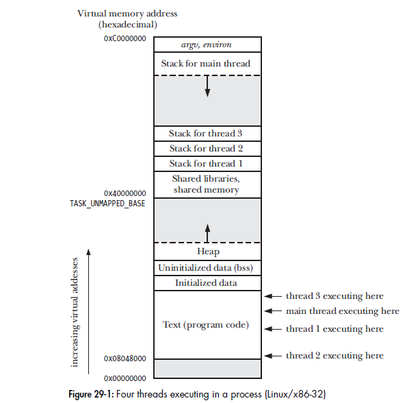

# Posix Threads

A thread is a mechanism that allow an application to perform multiple tasks concurrently.
A single process can contain multiple threads. All of the threads are independently executing
the same program and they all share the same global memory including the initialized data,
uninitialized data and heap memory segments



## Threads and Errno

in the traditional UNIX API, errno is a global variable. However this doesn't suffice for threaded programs,
if a thread made a function call that returned an error in global errno variable, then this would confuse other
threads that might also be making function calls to check errno, therefore in threaded programs each thread has
its own errno value.

## Return value

All pthreads function return 0 on success or positive integer on failure. the failure value is the same
value that can be placed in errno

## Compiling Pthreads prograns

On linux, programs that use pthread api must compile with -pthread option the effect if this option 
include the following:

- the _REENTRANT preprocessor macro is defined this cause the  declaration of a few reentrant function to be 
exposed.

- the program is linked with the *libpthread* library (-lpthread)

## Thread creation

```c
#include <pthread.h>

int pthread_create(pthread_t *thread, const pthread_attr_t *attr,
 void *(*start)(void *), void *arg);
```

When a program is started the resulting process consists of a single thread called the initial or main thread,
the pthread_function create new thread. The new thread begin execution by calling the function identified by start
with the argument arg ( start(arg) ). the thread that calls pthread_create continue execution.
- The *arg* is declared as void * meaning that we can pass a pointer to any type of object to the start function.
and the same implies for the return value.
- The *thread* argument point to a buffer of type *pthread_t* into which the unique identifier for this thread is copied
before *pthread_create* is returned. this identifier can be used later to refer to that thread.
- The *attr* argument is pointer to *pthread_attr_t* object that specifies various attributes for the new thread
if *attr* is *NULL* then the thread is created with various default attributes.

After the call to *pthread_create* a program has no guarantees about which thread will be next scheduled by the 
[task scheduler](https://en.wikipedia.org/wiki/Scheduling_(computing)#Process_scheduler). If we want need to enforce
a particular order of execution we must use one of the synchronization techniques.

## Thread termination

The execution of a thread terminates in one of the following ways:

- the thread start function performs a return value.
- the thread calls *pthread_exit()*.
- the thread is canceled using *pthread_cancel()*.
- any of the threads call *exit()* or the main thread performs a return in the main function.

```c
#include <pthread.h>
void pthread_exit(void *retval);
```

Calling the *pthread_exit()* is equavalent to performing a return in the thread start function.

## Thread IDs

Each Thread withing a process is uniquely identified by a thread ID, this ID is returned to the caller
of *pthread_create()* and a thread can obtain its own id using *pthread_elf()*.

```c
#include <pthread.h>
pthread_t pthread_self(void);
```
Thread IDs are useful withing the following reasons:

- Various pthreads functions use thread IDs to identifier the thread on which they are to act.
- It can be useful to tag dynamic data with the id of a particular thread

The *pthread_equal()* function allows us to check whether tow thread IDs are the same.
```c
#include <pthread.h>
int pthread_equal(pthread_t t1, pthread_t t2);
```

## Joining with a terminated thread

The *pthread_join()* function waits for the thread identified by thread to terminate. And if the thread
is already terminated the function return immediately. The operation is termed joining
```c
#include <pthread.h>
int pthread_join(pthread_t thread, void **retval);
```

Calling *pthread_join()* for a thread ID that has been already join can lead to undefined behavior. It
might instead joined a thread created later that happens to have the same ID. If a thread is not detached,
then we must join with it using *pthread_join()*. If we fail to do this then when the thread terminates
it produced the thread equivalent of a zombie process.
The task of *pthread_join()* is similar to that performed by *waitpid()* for precesses.
